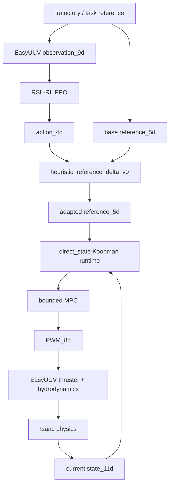

# Agentic-AUV / EASYkoopman 项目交接文档

**更新日期：** 2026-08-09
**项目目录：** `E:\code for project\Agentic AUV\EasyUUV`
**服务器别名：** `agentic-AUV`
**服务器项目目录：** `/root/EASYkoopman`
**当前分支：** `isaaclab2-migration`
**本文类型：** 项目解释 + 工程交接参考

## 1. 交接结论

这个项目已经不再只是原 EasyUUV 的控制器参数修改。我们保留了 EasyUUV 的 Isaac 物理环境、AUV USD、推进器几何和水动力链路，在它们之上建立了以下完整研究基础设施：

```text
EasyUUV legacy baseline
  -> 可验证的状态/reference/PWM 数据
  -> 离线 Koopman identification
  -> 模型质量门和 paper-style lifted EDMD 对照
  -> 有约束 Koopman-MPC 低层控制
  -> PPO 到 Koopman reference 的显式 adapter
  -> 在 Koopman-MPC 闭环中重新训练的 PPO
  -> reward / adapter / MPC 消融、交叉组合和 Pareto gate
```

目前最重要的事实不是“新控制器已经全面优于原算法”，而是：

1. 从数据采集、Koopman 训练、模型准入、MPC 控制到 PPO 重训练的端到端链路已经打通。
2. 原 `legacy/Ssurface` 在 nominal 单平台任务上仍是最强 controller-only baseline。
3. `direct_state Koopman+MPC` 可以在 Isaac 中闭环运行，但 tracking、fallback 和 PPO-reference 接口仍需诊断。
4. `paper_lifted_edmd` 已作为论文风格对照运行，但当前 depth RMSE 过大，不能作为默认控制后端。
5. Phase 5.4 完成了正式参数搜索，却得到 `NO_SELECTION`。这不是运行失败，而是有效地证明了：只调 reward 和 MPC 小参数不足以产生全指标 winner。
6. LLM 和 online Koopman update 尚未接入当前闭环，不能写成已完成成果。

当前最合理的下一步是 Phase 5.5：固定 PPO checkpoint，诊断 `action_4d -> reference_5d` 的语义和 `no_cost_improvement` fallback 的来源。

## 2. 原始 EasyUUV 算法链路

原 EasyUUV 在本项目中的实时控制结构可以概括为：

```text
任务目标 / trajectory
  -> 9D observation
  -> RSL-RL PPO 或 direct scripted action
  -> 4D action
  -> legacy S-Surface / PID
  -> 8D PWM
  -> dead zone + thrust polynomial
  -> 推进器 force / torque
  -> buoyancy + drag + viscosity
  -> Isaac physics
```

主要维度和语义：

| 层 | 输入 | 输出 | 原始职责 |
|---|---|---|---|
| PPO | `observation_9d` | `action_4d` | 根据目标姿态、当前深度和姿态产生姿态/深度修正。 |
| Legacy controller | `action_4d` | `pwm_8d` | 用 S-Surface/PID 把高层修正转成推进器控制。 |
| Thruster/hydrodynamics | `pwm_8d` | force/torque | 执行死区、推力多项式、推进器映射和水动力。 |
| Isaac | force/torque | next state | 推进仿真状态。 |

原架构的优点是控制链短、没有预测模型误差、没有 MPC 求解延迟和 fallback。它也是本项目始终保留的安全基线。

原 EasyUUV 论文所描述的 LLM 属于低频参数调整或任务层，不应被理解为每个 physics step 都由 LLM 控制。当前这个仓库中没有已经接入实时闭环的 LLM 接口。

## 3. 我们对原算法做了什么

### 3.1 建立可学习、可复现的数据边界

原控制链主要关心仿真和控制结果，没有为 Koopman identification 提供统一监督样本。Phase 1 增加了 pre-thrust PWM 可见性和统一 JSONL：

```text
t
state_11d
reference_5d
action_4d
pwm_8d
next_state_11d
trajectory_type
controller_mode
```

这里使用 `pwm_8d` 作为 Koopman 控制输入，而不是只使用 `action_4d`。原因是 PWM 更接近真正进入推进器物理链的控制量，也与后续 MPC 的控制权限一致。

这项改造建立了贯穿后续阶段的统一数据合同：同一份日志可以用于模型训练、离线预测评估、MPC replay、闭环对照和 PPO/Koopman 诊断。

### 3.2 把项目迁移到实际服务器环境

原代码和早期文档不是按服务器上的 Isaac Lab 2.2.1 编写。Phase 1.5 完成了以下兼容工作：

- Isaac Sim 5.0 + Isaac Lab 2.2.1 AppLauncher 启动顺序。
- `DirectRLEnv` observation/action/reset 接口迁移。
- USD articulation root 与 rigid object 冲突处理。
- 环境注册、headless rollout 和资源路径修复。
- 保留同一 USD、推进器和水动力逻辑。

服务器环境已经验证：

```text
Isaac Sim 5.0
Isaac Lab 2.2.1
Ubuntu 22.04
NVIDIA RTX 4090
```

### 3.3 增加离线 Koopman identification 和模型准入门

Phase 2 将日志转成离线 Koopman 模型。当前工程后端可以写成：

```text
x[k+1] = A x[k] + B u[k] + E r[k] + nonlinear features
```

其中：

- `x[k]` 是 11D AUV state；
- `u[k]` 是 8D PWM；
- `r[k]` 是 5D 深度/四元数 reference；
- 参数通过 ridge-regularized EDMD/线性回归得到。

Phase 2.5 没有直接使用训练误差最小的模型，而是增加了：

- log-level train/validation/test split；
- persistence 和 simple-linear baselines；
- normalization candidate；
- one-step 与 multi-step rollout 指标；
- divergence / non-finite / physical-envelope gate；
- selected model manifest。

最终进入工程 MPC 的模型是：

```text
candidate_id = direct_state_selected_quadratic_ridge_0p0001_norm_off
model_class = direct_state
control_dim = 8
test multi_step_rmse@20 = 0.5243264020
gate_status = pass
```

这不是在宣称 direct-state 等价于论文中的 lifted Koopman，而是把“工程可运行后端”和“论文风格后端”明确分开。

### 3.4 建立 paper-style lifted EDMD 对照

Phase 3.5 单独构建并评估 `paper_lifted_edmd`：

```text
state/reference error
  -> 小型、可解释 observable dictionary
  -> lifted-space EDMD
  -> Koopman prediction
  -> 与 direct_state 使用相同 MPC 接口
```

它的价值是形成论文方法对照，避免把 direct-state 线性预测器包装成完整 paper-style Koopman。服务器 smoke 和 Phase 4 matched evaluation 均已运行。

当前结论是：这个 backend 具有对照价值，但深度闭环误差很大，不能作为默认低层控制器。后续若要继续研究，应先诊断 observable、训练分布和 depth dynamics mismatch。

### 3.5 用 Koopman-MPC 替换低层 PWM 决策

Phase 3 在保留推进器/水动力的前提下增加：

```text
current state + reference + previous PWM
  -> Koopman runtime prediction
  -> bounded receding-horizon MPC
  -> pwm_8d
  -> original EasyUUV thruster/hydrodynamics
```

MPC 的工程目标函数包括：

```text
tracking cost
+ control effort cost
+ PWM smoothness cost
+ terminal tracking cost
```

同时施加：

```text
PWM bounds = [-1, 1]
per-step PWM delta limit
short horizon
solver timeout
finite-value checks
```

如果求解失败、超时或候选控制没有比 fallback 基线更低的 cost，控制器使用 legacy/hold PWM fallback。也就是说，新研究控制器失效时不会直接向推进器发送未约束输出。

### 3.6 将 PPO 作为高层 reference generator 接入

PPO 输出仍是历史 4D action，而 Koopman-MPC 需要 5D 深度/姿态 reference。Phase 4.5 新增：

```text
heuristic_reference_delta_v0
```

它把 PPO action 暂时解释为：

```text
delta depth + delta roll/pitch/yaw
```

然后和 base reference 组合成：

```text
[depth_ref, quaternion_ref_wxyz]
```

这使下面的链路可以运行：

```text
PPO action_4d
  -> heuristic_reference_delta_v0
  -> adapted reference_5d
  -> Koopman+MPC
  -> PWM_8d
```

但这个 adapter 是显式命名的启发式桥梁，不代表原 PPO action 语义已经无损迁移。

### 3.7 训练真正属于 Koopman-MPC 闭环的 PPO

旧 PPO checkpoint 是在 `PPO -> legacy controller` 的 transition 下学到的。更换低层控制器后，同一个 action 对 next state 的影响发生变化，因此旧 checkpoint 只能用于 baseline 或兼容 smoke。

Phase 4.6 和 Phase 5 建立了三类严格分开的证据：

| Result bucket | 含义 |
|---|---|
| `legacy_ppo_baseline` | 原 PPO + legacy controller 的 checkpoint 证据。 |
| `old_checkpoint_adapter_smoke` | 旧 checkpoint 可以穿过 adapter，但不证明性能或语义等价。 |
| `retrained_ppo_koopman_mpc` | PPO 在 adapter + Koopman-MPC transition 中重新训练。 |

真正的新 PPO 训练路径是：

```text
RSL-RL rollout
  -> PPO action_4d
  -> adapter 在 env.step() 前刷新 reference_5d
  -> Koopman-MPC 产生 PWM_8d
  -> Isaac next state/reward
  -> PPO update
```

项目没有重新手写 PPO 算法，而是复用 RSL-RL PPO，把创新放在控制闭环、动作语义、reward health、provenance 和评价方法上。

### 3.8 从“调一个参数”升级到证据化多指标选择

Phase 5.1 至 5.4 逐步增加：

- stability sentinel 和 200-iteration candidate；
- checkpoint provenance；
- fallback、latency、PWM、clip、non-finite training health；
- step/sine/irregular matched evaluation；
- one-factor ablation；
- reward/adapter/MPC cross-combination；
- parameter distance 和 small-parameter-first 原则；
- latency max/violation gate；
- fallback reason gate；
- `full_pass / track_pass / promising_partial / no_selection` 分层；
- Pareto report 和 diagnostic-stop rule。

这部分的核心突破不是某个参数值，而是：实验不会因为单个 RMSE 看起来更好就宣布 winner，也不会把没有通过 gate 的 checkpoint 偷换成“已优化控制器”。

## 4. 当前真实链路

### 4.1 正常 Koopman-MPC PPO 路径



控制权限分层：

| 模块 | 可以控制什么 | 不能控制什么 |
|---|---|---|
| PPO | 4D 高层修正 | 不能直接输出 8D PWM。 |
| Adapter | 把修正变成 bounded 5D reference | 不能绕过 MPC。 |
| Koopman | 预测候选 PWM 下的状态变化 | 不能直接施加力。 |
| MPC | 在约束内选择 8D PWM | 不能绕过 actuator bounds。 |
| Legacy fallback | 在 MPC 不可信时给出安全替代 PWM | 不作为 Koopman 成功证据。 |
| Isaac physics | 执行推进器和水动力 | 不训练 Koopman 或 PPO。 |

### 4.2 Fallback 路径

```text
MPC timeout / non-finite / infeasible / no_cost_improvement
  -> legacy or hold PWM fallback
  -> clip to actuator bounds
  -> original thruster/hydrodynamics
```

当前最需要诊断的是 `no_cost_improvement`：MPC 候选可能因为 reference 语义、模型误差、control/smoothness 权重或 actuator/delta bounds，无法比 fallback PWM 获得更低预测 cost。

### 4.3 尚未进入链路的内容

```text
LLM supervisor          尚未实现
online Koopman KF/RLS   尚未实现
native_reference_delta_v1  尚未实现，等待 Phase 5.5 证据
real AUV deployment     尚未验证
multi-platform OOD data 尚未系统生成
```

## 5. 服务器证据账本

### 5.1 Koopman 和 controller-only 证据

Phase 2.5 的模型准入通过，Phase 4 在每条轨迹上对三种 controller-only backend 各运行 1400 samples：

| Trajectory | Controller | Depth RMSE | Attitude RMSE | Fallback |
|---|---|---:|---:|---:|
| step | legacy/Ssurface | 0.3988 | 0.9542 | 0.000 |
| step | direct_state Koopman-MPC | 1.0372 | 2.0443 | 0.118 |
| step | paper_lifted_edmd MPC | 14.2359 | 1.0990 | 0.166 |
| sine | legacy/Ssurface | 0.3980 | 0.7840 | 0.000 |
| sine | direct_state Koopman-MPC | 0.8985 | 2.2372 | 0.106 |
| sine | paper_lifted_edmd MPC | 13.4571 | 0.9059 | 0.171 |
| irregular | legacy/Ssurface | 0.3742 | 1.0556 | 0.000 |
| irregular | direct_state Koopman-MPC | 0.5514 | 1.3625 | 0.387 |
| irregular | paper_lifted_edmd MPC | 14.2464 | 1.0831 | 0.199 |

由此得到的严谨结论是：

- legacy/Ssurface 仍是 nominal controller-only 强基线；
- direct_state Koopman-MPC 的闭环和约束成立，但尚未优于 legacy；
- paper-lifted 当前主要是论文对照，不是可推广控制器。

### 5.2 PPO 链路证据

| Phase | 证据 | 结果边界 |
|---|---|---|
| 4.5 | stub policy，350 samples，fallback 0.28，latency mean 11.87 ms | 证明 adapter/control plumbing，不证明 PPO。 |
| 4.6 | PPO training/checkpoint discovery/load smoke | 证明 RSL-RL checkpoint 机制，不证明收敛。 |
| 5 | Koopman-MPC PPO 一次短训和 2-sample reload smoke，fallback 0.0 | 证明 PPO 真走新 transition，不证明性能。 |
| 5.1 | 50-iteration sentinel、200-iteration stability candidate 和 provenance/matched-eval 合同 | 证明可以进行长于 smoke 的稳定训练候选，不证明最终收敛。 |

### 5.3 Phase 5.2 one-factor ablation

全部候选训练 200 iterations，并在 step/sine/irregular 上各评估 350 samples：

| Profile | Fallback | PWM sat | Clip | Depth RMSE | Attitude RMSE |
|---|---:|---:|---:|---:|---:|
| baseline_rerun | 0.2333 | 0.2293 | 0.0517 | 0.8564 | 0.8135 |
| reward_v1_only | 0.1248 | 0.3379 | 0.1393 | 0.9360 | 0.7434 |
| adapter_soft_v1_only | 0.1114 | 0.3963 | 0.1088 | 1.0074 | 0.7449 |
| mpc_health_v1_only | 0.1524 | 0.3731 | 0.4952 | 2.0573 | 0.7004 |

`reward_v1_only` 是最均衡的研究候选，但没有通过完整 promotion gate，因为 PWM saturation 明显回退。

### 5.4 Phase 5.3 cross-combination

| Profile | Fallback | PWM sat | Clip | Depth RMSE | Attitude RMSE | Gate |
|---|---:|---:|---:|---:|---:|---|
| reward + adapter soft | 0.1514 | 0.3748 | 0.0000 | 1.7543 | 0.7512 | fail |
| reward + MPC health | 0.3105 | 0.1192 | 0.0400 | 0.7173 | 0.7354 | fail |
| adapter soft + MPC health | 0.2724 | 0.2094 | 0.4683 | 0.5022 | 0.7769 | fail |

这里发现了重要交叉信号：`reward + MPC health` 同时改善 PWM、clip、depth 和 attitude，但 fallback 从 0.1248 上升到 0.3105。它是诊断父项，不是选中的控制器。

### 5.5 Phase 5.4 Pareto sweep

执行情况：

```text
Round 1 sentinels = 11/11
Round 1 candidates = 11/11
matched step/sine/irregular = complete for every candidate
selection_status = no_selection
selected_profile_id = null
Round 2 = skipped by predeclared diagnostic-stop rule
```

有代表性的候选：

| Profile | 主要优势 | 主要失败 |
|---|---|---|
| `r_pwm030_action_smooth` | PWM sat 0.0985，depth RMSE 0.4838 | fallback 0.2419，未保住 reward parent。 |
| `rm_timeout14` | fallback 0.0971，PWM sat 0.1156 | clip/depth/attitude 丢失 MPC parent 优势。 |
| `rm_midweights_timeout14` | fallback 0.1248，clip 0.0090 | PWM sat 0.2938，depth RMSE 1.1573。 |
| `rm_horizon4_timeout14` | PWM sat 0.0206，depth 0.5289，latency 9.97 ms | fallback 0.2390，`no_cost_improvement` 增加。 |

Phase 5.4 支持三个判断：

1. latency 不是当前第一瓶颈，正式候选 mean latency 均低于 20 ms。
2. reward/MPC 小参数能改善局部指标，但不足以修复全链路权衡。
3. 下一步应诊断 adapter/reference 语义和 fallback cost，而不是继续扩大相同参数搜索。

## 6. 当前创新点

“创新点”必须区分已实现机制和待验证研究主张。

### 6.1 已实现并有证据的工程/方法创新

1. **保留 EasyUUV 物理链，只替换控制决策层。** 这使 legacy、Koopman-MPC 和 PPO-conditioned Koopman-MPC 可以在同一 USD、推进器和水动力下 matched comparison。
2. **以真实 8D PWM 为 Koopman/MPC 控制接口。** 避免用历史 4D action 掩盖推进器实际控制语义。
3. **双后端诚实对照。** `direct_state` 明确是工程后端，`paper_lifted_edmd` 明确是论文风格研究后端，两者不会互相冒充。
4. **PPO action 到 Koopman reference 的显式合同。** `heuristic_reference_delta_v0` 把不可见的控制器交换假设变成可记录、可测试、可淘汰的模块。
5. **Koopman-MPC-conditioned PPO provenance。** 只有训练 rollout 真正经过 adapter 和 Koopman-MPC 的 checkpoint，才能进入 `retrained_ppo_koopman_mpc` 结果桶。
6. **Fallback-aware、evidence-level-aware 评价。** 不只看 reward/RMSE，还记录 fallback reason、latency、PWM saturation、action clipping、checkpoint 来源和 matched trajectory。
7. **允许 `NO_SELECTION` 的 Pareto gate。** 参数搜索可以给出“没有可推广候选”，而不是被迫选一个局部最好但整体退化的模型。

### 6.2 有研究潜力但尚未完成证明的创新主线

1. PPO 作为高层 reference generator，Koopman-MPC 作为可预测、可约束低层控制器。
2. `native_reference_delta_v1` 让 PPO 原生学习 MPC reference，而不是重新解释历史 action。
3. 跨平台 conditional/lifted Koopman，在 held-out AUV dynamics 上评价 OOD degradation。
4. offline Koopman prior + online KF/RLS update，用少量 shifted-domain 数据恢复控制性能。
5. LLM 作为低频、可审批 supervisor，读取诊断结果并提出 bounded reference 或配置建议。

这些内容只有在 Phase 5.5 之后逐项实现和通过 gate，才能成为论文贡献，而不是现在就可以使用的结论。

## 7. Agentic-AUV 剩余工作

### Phase 5.5：接口语义与 fallback 诊断

目标：解释 Phase 5.4 为什么 `NO_SELECTION`。

主要工作：

- 固定 `baseline_rerun`、`reward_v1_only`、`cross_reward_v1_mpc_health` 等 checkpoint；
- sweep `rpy_delta_scale` 和 `depth_delta_scale`；
- 记录 fallback PWM cost、MPC best cost、cost improvement margin；
- 记录 feasible candidates、active PWM/delta bounds；
- 比较 predicted error 和 actual next-state error；
- 形成 reason-level failure taxonomy。

停止条件：如果 scale 变化没有稳定规律，或 action/reference 方向与实际 tracking 改善不一致，停止启发式微调并进入 Phase 5.6。

### Phase 5.6：Native reference action

目标：让 PPO action 的原生语义直接成为 depth/attitude reference correction。

建议合同：

```text
action_4d = [delta_depth, delta_roll, delta_pitch, delta_yaw]
```

必须重新训练 PPO，并与 heuristic adapter、scripted reference、random smoke 做 matched comparison。旧 checkpoint 不能改名复用。

### Phase 6：跨平台 Koopman 数据与泛化

目标：把研究场景从单一 nominal AUV 扩展到 held-out dynamics。

建议变化维度：mass、buoyancy、COM/COB、thruster efficiency、damping、current、sensor noise/latency。数据必须按 platform split，不能用 row-level random split 冒充 OOD 泛化。

### Phase 7：Online Koopman-KF/RLS

目标：用少量 shifted-domain 数据更新 Koopman dynamics，测量 prediction/control recovery curve。

先做 offline replay 和 Isaac domain shift，再考虑真实水池数据。在线更新必须具有参数更新限幅、non-finite gate、rollback 和 frozen prior。

### Phase 8：最终 matched evaluation

目标：完成 nominal、held-out platform、disturbance 和 combined-shift 的核心论文实验。

最终对照至少包括：

```text
legacy/Ssurface
original PPO + legacy
offline Koopman-MPC
PPO + offline Koopman-MPC
online Koopman-KF/RLS-MPC
PPO + online Koopman-KF/RLS-MPC
```

### Phase 9：可选 LLM supervisor

LLM 只能：

- 读取任务和实验 summary；
- 提出 bounded reference plan；
- 提出配置建议；
- 解释失败类别；
- 在人工批准后触发离线/服务器实验。

LLM 不能直接调用实时 `env.step()`、产生 PPO action 或发送 PWM，也不能未经批准写入 Koopman/MPC/PPO 参数。

## 8. 本地与服务器职责

| 工作 | 本地 | agentic-AUV |
|---|---|---|
| schema、模型训练、日志分析、selector、单元测试 | 可以 | 可以 |
| Isaac env 创建、physics rollout、USD 验证 | 不可可靠执行 | 必须 |
| PPO/RSL-RL Isaac training | 不适合 | 必须 |
| matched step/sine/irregular evaluation | 分析可以 | rollout 必须 |
| platform/domain shift rollout | 配置与分析可以 | 必须 |
| online update offline replay | 可以 | 闭环验证必须 |

服务器常用位置：

```text
Isaac Lab: /root/IsaacLab
Project:   /root/EASYkoopman
Results:   /root/EASYkoopman/source/results
RSL-RL:    /root/IsaacLab/logs/rsl_rl
```

服务器访问 GitHub 曾多次出现 TLS timeout。传输优先级应为：正常 pull、git bundle、zip/scp。不能因为服务器仓库拉取失败就假设本地代码也不存在。

## 9. 接手文件地图

第一组必读：

| 文件 | 用途 |
|---|---|
| `.planning/ROADMAP.md` | 当前 canonical 阶段顺序和边界。 |
| `.planning/STATE.md` | 当前 focus、冻结决定和下一动作。 |
| `docs/Agentic_AUV_next_steps_plan.md` | Phase 5.5 之后的研究判断。 |
| `docs/project_parameters_and_work_summary_2026_07_05.md` | 参数、阶段、指标和难点总表。 |
| 本文 | 上游差异、真实链路、证据和交接入口。 |

算法与控制：

| 文件/目录 | 职责 |
|---|---|
| `easyuuv_env.py` | Isaac 环境、legacy/Koopman controller switch、reward、state/action contract。 |
| `koopman/` | dataset、lifting、EDMD、runtime、MPC、adapter 和 Phase 5 profiles。 |
| `agents/rsl_rl_ppo_cfg.py` | RSL-RL PPO 参数。 |
| `workflows/train_ppo_koopman.py` | Koopman-MPC-conditioned PPO training entry。 |
| `workflows/play_ppo_koopman.py` | checkpoint/stub PPO + Koopman-MPC evaluation。 |
| `workflows/play_controller.py` | controller-only legacy/Koopman evaluation。 |
| `workflows/analyze_phase5_2_health.py` | matched health metrics。 |
| `workflows/select_phase5_4_candidate.py` | Phase 5.4 Pareto gate。 |

关键证据：

`source/results/` 包含服务器同步回来的实验产物，其中部分文件较大或仍处于未跟踪状态。它是证据目录，不应默认认为每个 Git clone 都会自动拥有完整结果；接手时应同时检查本地目录和服务器 `/root/EASYkoopman/source/results`。

| 路径 | 内容 |
|---|---|
| `source/results/koopman_phase2_5_verify_20260701_231802/` | selected Koopman model 和 gate。 |
| `source/results/koopman_phase4/` | controller-only 9-run matrix。 |
| `source/results/koopman_phase5/` | PPO-Koopman-MPC training smoke。 |
| `source/results/koopman_phase5_1/` | stability checkpoint/summary。 |
| `docs/phase5_2_server_training_results.md` | Phase 5.2 服务器结果。 |
| `docs/phase5_3_cross_combination_server_results.md` | Phase 5.3 服务器结果。 |
| `source/results/koopman_phase5_4/` | 11-profile sweep 和 `NO_SELECTION`。 |

## 10. Git 恢复点和工作树警告

本文准备时：

```text
branch = isaaclab2-migration
baseline HEAD = 11e59582295469a1fa7fb8aeebbfbdd956f27f1e
```

工作树在交接前已经包含多项 Phase 5.1 至 5.4 代码、测试、planning 和 result artifact，它们不是本次 handover 修改产生的临时文件。不要执行 `git reset --hard`、`git clean` 或批量 restore。

包含本文的交接提交应以当前 `git log -1 --oneline` 为准。由于 Git commit SHA 由文件内容决定，文档不能在同一个提交内可靠地写入自己的最终 SHA。

## 11. 允许和禁止的项目表述

可以说：

```text
项目已经在 EasyUUV/Isaac 上打通数据、Koopman identification、MPC、PPO adapter、
Koopman-MPC-conditioned PPO training 和多阶段 matched evaluation。

Phase 5.4 完成了 bounded Pareto sweep，但没有候选通过推广 gate。

当前证据支持进入 adapter/reference semantics 和 fallback diagnosis。
```

不能说：

```text
Koopman-MPC 已经全面优于 legacy/Ssurface。
PPO 已经最终收敛或可以部署。
paper_lifted_edmd 已经复现论文性能。
LLM 已经接入 Agentic-AUV 控制链。
Koopman 已经在线学习。
Phase 5.4 已经找到最优参数。
```

## 12. 下一位开发者的第一项任务

不要先训练更多 PPO，也不要先接 LLM。第一项任务是为 Phase 5.5 创建 SPEC/PLAN，并把以下诊断变成可记录字段和固定-checkpoint 实验：

```text
reference_delta_norm
fallback_pwm_cost
mpc_best_cost
cost_improvement_margin
candidate_count / feasible_candidate_count
active_pwm_bound_count
active_delta_limit_count
predicted_next_error
actual_next_error
prediction_error_gap
fallback_reason distribution
```

Phase 5.5 的交付结论应是一个可验证选择：

```text
retain heuristic_reference_delta_v0
或
reject heuristic bridge and enter native_reference_delta_v1
```

这一步完成以后，Agentic-AUV 才有清晰的动作语义基础继续做跨平台、在线 Koopman 和最终的低频 agent supervisor。
