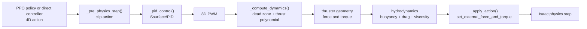
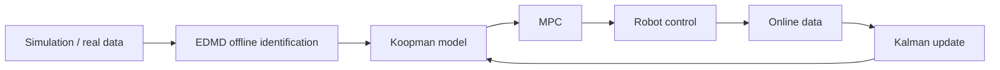
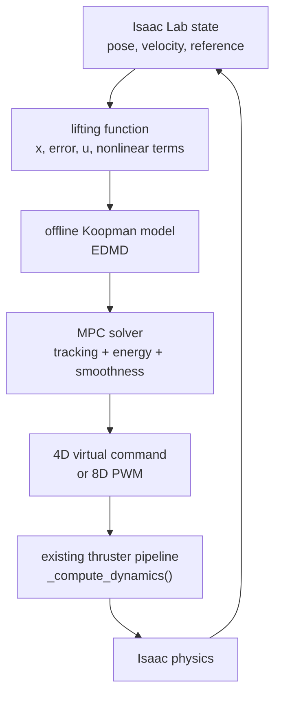
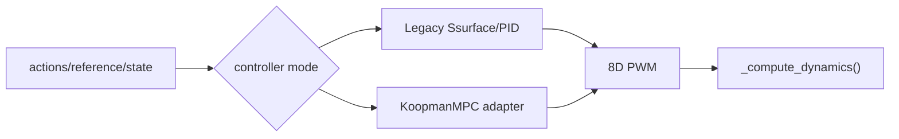

# EasyUUV Koopman+MPC 控制迁移方案

**创建日期:** 2026-06-10  
**读者:** 后续实现 Koopman+MPC 控制器的开发者和研究者  
**源事实:** 当前 EasyUUV 代码、README、EasyUUV/TIE 论文笔记、Koopman-Sim2Real 论文笔记  
**状态:** 历史迁移设计，Phase 1 至 Phase 5.4 已按后续 SPEC/PLAN 实施；阶段编号和当前结论以 `.planning/ROADMAP.md`、`.planning/STATE.md` 和 `docs/Agentic_AUV_project_handover.md` 为准

> **阅读提示：** 本文保留 2026-06-10 的初始迁移判断，用于解释项目为什么选择“保留 EasyUUV 物理链并替换低层控制器”。文中的五阶段 GSD 表已经被后续实验扩展，不能作为当前执行顺序。当前下一阶段是 Phase 5.5；LLM 已后置为可选 Phase 9 supervisor。

## 结论

EasyUUV 当前已经是 Isaac Sim/Lab 仿真任务，第一阶段不应重写为原生 Isaac Sim standalone app。更稳妥的路线是保留 Isaac Lab `DirectRLEnv`、AUV 资产、推进器几何、水动力和评估脚本，只替换低层控制器。

Koopman+MPC 的第一版应接在当前 `_pid_control()` 所在的控制层附近：先让 MPC 产生与当前 action 语义兼容的 4D 虚拟控制量，或后续直接产生 8D PWM，再复用 `_compute_dynamics()` 中已有的推进器和水动力模型。这样可以避免同时改变控制算法、仿真框架和物理模型。

## 范围

本文档覆盖：

- 当前 EasyUUV 控制链路。
- Koopman+MPC 的目标架构。
- GSD 阶段计划。
- Phase 1 的最小实施边界。
- 数据采集、EDMD、MPC 和评估的衔接关系。

本文档不覆盖：

- 真实硬件部署细节。
- Kalman 在线更新实现。
- 完整 6-DOF MPC 数学推导。
- Isaac Sim/Lab 本机安装验证。该项仍为待确认。

## 当前架构

当前 EasyUUV 的核心环境在 `easyuuv_env.py`。控制链路可以概括为：



关键事实：

| 位置 | 当前作用 | 迁移判断 |
|------|----------|----------|
| `EasyUUVEnvCfg.sim = SimulationCfg(dt=1 / 120)` | 仿真时间步 | 保留 |
| `decimation = 2` | 控制频率约 60 Hz | MPC 第一版按 60 Hz 预算 |
| `num_actions = 4` | policy/direct controller 输出 4D action | 第一版继续兼容 |
| `num_observations = 9` | policy 观测为 goal quat、depth、current quat | PPO 路径暂不改 |
| `_pid_control()` | 4D action 到 8D PWM | Koopman+MPC 的主要替换点 |
| `_compute_dynamics()` | PWM 到力/力矩和水动力叠加 | 第一阶段保留 |
| `play_controller.py` | 不依赖 PPO 的 direct controller 入口 | Phase 1 首选验证入口 |
| `play_eval.py` / `play_eval_step.py` / `play_eval_task2.py` | 三类轨迹评估 | 复用为对照实验 |

## 论文方法如何落到代码

### EasyUUV 的启发

EasyUUV 论文的架构是三层：

1. PPO 输出 4D 姿态/深度修正指令。
2. A-S-Surface/PID 将修正指令转成底层执行器命令。
3. LLM 低频调整控制器参数，不直接参与实时控制。

这说明当前代码的实时控制安全边界在低层控制器，而不是 LLM 或高层策略。我们的迁移也应保持这个分层：Koopman+MPC 替换 A-S-Surface/PID，不让 LLM 或研究性模块直接输出推进器控制。

### Koopman-Sim2Real 的启发

Koopman-Sim2Real 论文的主线是：



需要注意的是，论文验证对象是 3-DOF 平面运动，主要处理 surge、sway、yaw。EasyUUV 是 6-DOF AUV 和 8 推进器系统，因此不能直接照搬论文的状态向量和控制量。可以继承的是方法结构：先用仿真数据训练 Koopman 先验，再用 MPC 做有约束控制，最后再讨论在线更新。

## 目标架构

第一版目标架构：



推荐的第一版状态设计：

```text
x = [z, roll, pitch, yaw, vz, p, q, r]
r = [z_ref, roll_ref, pitch_ref, yaw_ref]
e = r - controlled_state
u = [roll_cmd, pitch_cmd, yaw_cmd, depth_cmd]
```

推荐的第一版 lifting 函数包含：

```text
phi = [
  x,
  e,
  u,
  e_dot,
  angular_rate^2,
  vertical_velocity^2,
  u^2
]
```

设计理由：

- `e` 直接把跟踪目标放进 Koopman 特征，符合 Koopman-Sim2Real 论文的核心思想。
- `angular_rate^2` 和 `vertical_velocity^2` 捕捉水动力阻尼的主要非线性。
- 第一版不做完整 RBF 或大规模多项式字典，避免过拟合和 MPC 维度膨胀。

## GSD 阶段计划

| Phase | 名称 | 目标 | 主要产物 |
|-------|------|------|----------|
| 1 | Baseline Data And Controller Boundary | 保留 legacy baseline，建立控制器边界和数据采集 | controller mode 设计、PWM 可见性、数据 schema |
| 2 | Offline Koopman Identification | 从仿真日志训练 Koopman 模型 | `koopman/lifting.py`, `koopman/edmd.py`, 预测误差报告 |
| 3 | Koopman MPC Controller Integration | 将 Koopman+MPC 接入 EasyUUV 闭环 | MPC solver、controller adapter、fallback |
| 4 | Evaluation And Isaac Sim Runbook | 对比 legacy 与 Koopman+MPC，形成运行文档 | 统一指标、runbook、已知限制 |
| 5 | Online Adaptation And Sim2Real Readiness | 准备真实数据和在线更新 | Kalman/RLS 设计、真实日志回放、6-DOF 扩展计划 |

## Phase 1 详细计划

Phase 1 的目标是“不要急着实现 MPC”。它要建立后续所有阶段的地基。

### 1. 保护 legacy 控制器

保留当前默认：

```python
control_method = "Ssurface"
```

需要确认的行为：

- `Ssurface` 和 `PID` 分支仍然工作。
- 4D action 仍按 roll、pitch、yaw、depth 语义进入控制器。
- 8D PWM 最终仍被 clip 到 `[-1, 1]`。
- `_compute_dynamics()` 中推进器死区和推力多项式不变。

### 2. 建立 controller boundary

后续建议的控制模式：

```text
legacy/Ssurface
legacy/PID
koopman_mpc
```

第一阶段不必让 `koopman_mpc` 真正求解，只需要让代码结构上能接入：



### 3. 定义数据采集 schema

每条训练样本建议包含：

| 字段 | 说明 |
|------|------|
| `t` | 当前控制步或仿真时间 |
| `state` | 当前姿态、深度、速度和角速度 |
| `reference` | 当前目标姿态和目标深度 |
| `action_4d` | legacy/direct controller 输入 |
| `pwm_8d` | 推进器 PWM，进入推力模型前 |
| `next_state` | 下一步状态 |
| `trajectory_type` | `step`、`sine` 或 `irregular` |
| `controller_mode` | `Ssurface`、`PID`、后续 `KoopmanMPC` |

这样 Phase 2 可以直接构建：

```text
(x_k, r_k, u_k, x_{k+1})
```

### 4. 优先使用 direct controller

`workflows/play_controller.py` 已经能构造手写 4D action 并执行：

```python
obs, _, _, _ = env.step(action)
```

它不依赖 PPO checkpoint，因此是第一版数据采集和 controller seam 验证的最佳入口。PPO 路径可以等 Koopman+MPC 闭环稳定后再接入。

## Phase 2 到 Phase 3 衔接

Phase 2 输出的 Koopman model 至少需要：

| 内容 | 用途 |
|------|------|
| lifting 配置 | MPC 运行时把状态升维 |
| Koopman 矩阵 | 多步预测 |
| state normalization | 避免数值尺度影响求解 |
| model metadata | 记录训练轨迹、采样周期、特征维度 |
| prediction report | 判断模型是否足够用于闭环 |

Phase 3 的 MPC 代价函数建议从简单形式开始：

```text
J = tracking_error_weight
  + control_energy_weight
  + control_smoothness_weight
```

控制约束：

```text
-1 <= pwm_i <= 1
|delta_pwm_i| <= smooth_limit
solver_time <= control_budget
```

如果第一版使用 4D virtual command，则约束先作用在 4D command，再经过现有映射到 8D PWM。如果求解稳定后，再考虑直接优化 8D PWM。

## 验证策略

### 静态验证

目的：先确认改动没有引入 Python 语法错误。

```powershell
python -m py_compile easyuuv_env.py workflows\play_controller.py workflows\play_eval.py workflows\play_eval_step.py workflows\play_eval_task2.py
```

预期结果：语法检查通过。若本机普通 Python 无法解析 Isaac Lab import，应在 Isaac Lab Python 环境中执行并记录原因。

### 仿真验证

目的：确认 legacy controller 没有被破坏。

```bash
./isaaclab.sh -p source/standalone/workflows/rsl_rl/train.py --task EasyUUV-Direct-v1 --num_envs 4 --headless --max_iterations 1
```

预期结果：环境能实例化并执行短训练或短 rollout。

### 数据验证

目的：确认 Koopman 训练样本可离线读取。

预期检查：

- 文件存在。
- 字段完整。
- `pwm_8d` 长度为 8。
- 相邻样本能构造 `x_k` 和 `x_{k+1}`。
- `trajectory_type` 能区分 step、sine、irregular。

## GitHub 工作方式

目标远程：

```text
https://github.com/770122whrt/EASYkoopman.git
```

用户指定初始发布可以直接覆盖 `main` 分支。建议流程：

1. 在 `EasyUUV` 目录初始化独立 git 仓库。
2. 设置 branch 为 `main`。
3. 添加远程 `origin`。
4. 首次提交 EasyUUV 当前代码和 GSD 规划文档。
5. 使用 force push 覆盖远程 `main`。
6. 后续功能修改再从 `main` 开 feature branch。

待确认项：

- 当前 GitHub 认证是否可用。
- 远程仓库是否已有需要保留的内容。用户已允许覆盖，但执行前仍应在日志中明确这是覆盖发布。

## 已知风险

| 风险 | 影响 | 缓解 |
|------|------|------|
| Koopman 论文只覆盖 3-DOF | 直接照搬会模型错误 | 第一版只做姿态/深度子空间 |
| 数据激励不足 | EDMD 模型泛化差 | step、sine、irregular 都采集 |
| MPC 求解超时 | 控制频率下降 | 短预测域、低维控制、warm start |
| legacy baseline 被破坏 | 无法判断 Koopman 是否改进 | Phase 1 先保护 legacy 行为 |
| Isaac Lab 版本差异 | API 不兼容 | 记录本机版本，必要时单独开迁移阶段 |

## 下一步

按 GSD 路线，下一步执行 Phase 1：

1. 保留 legacy controller 默认行为。
2. 暴露 controller boundary 和 PWM 缓存。
3. 在 direct controller workflow 上实现数据记录。
4. 生成 Phase 1 summary，供 Phase 2 EDMD 使用。

所有后续代码改动都应以 `.planning/phases/01-baseline-data-controller-seam/01-PLAN.md` 为边界，不要提前实现 Phase 2/3 的内容。
# Phase 1 local implementation update (2026-06-29)

Local work has reached the Isaac Gate:

- `easyuuv_env.py` now has `controller_mode = "legacy"` while preserving the existing `control_method = "Ssurface"` / `"PID"` path.
- `_compute_dynamics()` caches `_last_pwm_8d` before dead-zone handling and thrust-polynomial conversion.
- `koopman_data.py` provides Isaac-free JSONL sample validation, writing, loading and `(x_k, u_k, r_k, x_{k+1})` reconstruction.
- `workflows/play_controller.py` is now the first direct-controller data path and does not require a PPO checkpoint.
- `workflows/play_eval.py`, `workflows/play_eval_step.py` and `workflows/play_eval_task2.py` emit the same Koopman schema for `sine`, `step` and `irregular` trajectories.

Current Koopman sample fields:

| Field | Content |
|------|------|
| `t` | Control-step timestamp; current workflows use `counter / 60`. |
| `state` | `[z, quat_wxyz, body_linear_velocity_xyz, body_angular_velocity_xyz]`. |
| `reference` | `[depth_ref, quat_ref_wxyz]`. |
| `action_4d` | Legacy/direct controller input. |
| `pwm_8d` | 8D PWM before thruster dead-zone and thrust-polynomial conversion. |
| `next_state` | Next-step state with the same schema as `state`. |
| `trajectory_type` | `step`, `sine` or `irregular`. |
| `controller_mode` | Currently `legacy/Ssurface`. |

Local verification:

```powershell
python -m pytest -p no:cacheprovider --capture=no tests -q
python -m compileall -q easyuuv_env.py koopman_data.py workflows\koopman_logging.py workflows\play_controller.py workflows\play_eval.py workflows\play_eval_step.py workflows\play_eval_task2.py
```

Server Isaac validation still required:

```bash
./isaaclab.sh -p <EasyUUV-path>/workflows/play_controller.py --task EasyUUV-Direct-v1 --num_envs 1 --headless
```

Expected result: `source/results/direct_controller/<run>/koopman_step.jsonl` exists and can be loaded with `koopman_data.load_koopman_samples()`.
