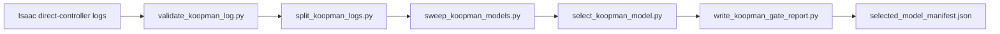

# Phase 2.5 Koopman 模型准入整理报告

本文档整理 2026-07-01 在 `agentic-AUV` 服务器上完成的 Phase 2.5 Koopman 验证结果。它的目的不是进入 Phase 3，也不是证明 Koopman+MPC 已经闭环稳定；它只回答一个更窄的问题：

```text
现有 Isaac 数据、离线 Koopman 训练代码、模型筛选 gate 是否已经形成一条可复现链路？
```

结论：Phase 2.5 离线 gate 已经可以复现通过。下一步可以准备 Phase 3 的 MPC 接入设计，但不应把当前结果解释成 MPC 闭环已经完成。

## 1. 本次从服务器拿回了什么

服务器路径：

```text
/root/EASYkoopman/source/results/koopman_phase2_5_verify_20260701_231802
/root/EASYkoopman/source/results/koopman_phase1/smoke_reverify_20260701_231917.jsonl
```

本地路径：

```text
E:\code for project\Agentic AUV\EasyUUV\source\results\koopman_phase2_5_verify_20260701_231802
E:\code for project\Agentic AUV\EasyUUV\source\results\koopman_phase1\smoke_reverify_20260701_231917.jsonl
```

`koopman_phase2_5_verify_20260701_231802` 是一次重新复跑得到的验证目录，不覆盖第一次的 `koopman_phase2_5`。它包含：

```text
split_manifest.json
selected_model_manifest.json
gate_report.md
sweep/
```

`smoke_reverify_20260701_231917.jsonl` 是真实 Isaac app 启动后的极短 smoke 日志，用来证明 direct-controller + Koopman logging 入口仍能在服务器 Isaac Lab 环境中运行。

## 2. Phase 2.5 验证了什么

Phase 2.5 做的是离线模型准入验证，流程如下：



这条链路验证了：

- JSONL 数据 schema 可被稳定读取。
- 训练、验证、测试采用 log-level split，而不是把同一条连续轨迹随机按行拆开。
- 多个 Koopman 候选模型和 baseline 可以自动 sweep。
- gate 能筛掉发散模型。
- 选中的模型在 held-out test log 上没有触发 divergence gate。
- 同样的数据重新跑一遍后，仍然选中同一个 candidate，并得到 `Gate Status: pass`。

这条链路没有验证：

- Koopman+MPC 闭环控制。
- 实时 MPC 求解速度。
- 控制输入约束下的稳定性。
- 与 legacy controller 的闭环性能对比。
- PPO policy 路径。服务器上没有发现 PPO checkpoint。

## 3. 输入数据

本次 Phase 2.5 使用三组长日志：

| 用途 | 日志 | 样本数 | 轨迹类型 | 控制器 |
|---|---|---:|---|---|
| train | `source/results/koopman_phase1/koopman_step_long.jsonl` | 1400 | `step` | `legacy/Ssurface` |
| validation | `source/results/koopman_phase1/koopman_sine_long.jsonl` | 1400 | `sine` | `legacy/Ssurface` |
| test | `source/results/koopman_phase1/koopman_irregular_long.jsonl` | 1400 | `irregular` | `legacy/Ssurface` |

每条样本的核心字段是：

```text
state: 11D
reference: 5D
action_4d: 4D
pwm_8d: 8D
next_state: 11D
trajectory_type
controller_mode
```

Phase 2.5 训练实际使用的控制输入是 `pwm_8d`，不是 PPO action。这样做的原因是 `pwm_8d` 更接近推进器动力学入口，适合作为 Koopman 模型的控制量。

## 4. 模型形式

当前选中的模型类别是 `direct_state`。它的预测形式可以写成：

```text
x_{k+1} = W [ phi(x_k, r_k), u_k ]
```

其中：

- `x_k` 是 11D 状态。
- `r_k` 是 5D reference。
- `u_k` 是 8D PWM。
- `phi(x_k, r_k)` 是 lifting 后的特征。
- `W` 是 ridge regression 训练得到的系数矩阵。

本次选中模型的 lifting 配置：

```json
{
  "include_bias": true,
  "include_reference": true,
  "include_error": true,
  "include_quadratic": true,
  "state_dim": 11,
  "reference_dim": 5
}
```

因此 `phi` 包含：

- 常数 bias。
- 当前状态 `x_k`。
- 当前 reference `r_k`。
- 跟踪误差 `x_k[:5] - r_k`。
- 上述非 bias 线性特征的平方项。

这不是论文里完整的最终控制器，只是为 MPC 提供一步预测模型。MPC 还没有接入。

## 5. 选中模型

本次复跑的 `selected_model_manifest.json` 给出的模型是：

```text
selected_candidate_id: direct_state_selected_quadratic_ridge_0p0001_norm_off
model_class: direct_state
ridge: 0.0001
normalizer_path: null
dt: 0.016666666666666607
model_path: source/results/koopman_phase2_5_verify_20260701_231802/sweep/models/direct_state_selected_quadratic_ridge_0p0001_norm_off.json
```

这里的 `dt` 约等于 1/60 秒，对应当前 direct environment 的控制步长。

## 6. Gate 指标

复跑验证结果：

| Split | one-step RMSE | RMSE@5 | RMSE@20 | RMSE@60 | divergence@20 | diverged |
|---|---:|---:|---:|---:|---:|---|
| validation | 1.15477 | 0.00564688 | 0.00485868 | 0.381052 | 0 | false |
| test | 1.45399 | 0.220474 | 0.524326 | 0.642604 | 0 | false |

baseline 对比：

| Baseline | Status | validation RMSE@20 | 说明 |
|---|---|---:|---|
| persistence | fail | 0.113645 | 60-step 判断为发散 |
| simple_linear | fail | 0.577989 | 60-step 明显发散 |

gate 通过的直接原因：

- 选中 candidate 的 validation RMSE@20 小于两个 baseline。
- validation 和 held-out test 上 `divergence_rate@20 = 0`。
- held-out test 没有触发 `has_diverged()`。
- 复跑后仍然得到同一个 best candidate。

需要谨慎解释的地方：

- one-step RMSE 较大，说明逐点一步预测并不完美。
- validation RMSE@20 很低，但 test RMSE@20 明显更高，说明不同轨迹分布之间仍有泛化压力。
- Phase 2.5 的 gate 是工程准入线，不是论文级最终证明。

## 7. 服务器验证命令摘要

服务器环境：

```bash
source /opt/conda/etc/profile.d/conda.sh
conda activate isaaclab
cd /root/EASYkoopman
```

轻量验证：

```bash
python -m compileall __init__.py koopman workflows tests
python -m pytest -q
```

结果：

```text
49 passed in 0.43s
```

日志验证：

```bash
python workflows/validate_koopman_log.py source/results/koopman_phase1/koopman_step_long.jsonl
python workflows/validate_koopman_log.py source/results/koopman_phase1/koopman_sine_long.jsonl
python workflows/validate_koopman_log.py source/results/koopman_phase1/koopman_irregular_long.jsonl
```

复跑 Phase 2.5：

```bash
OUT=source/results/koopman_phase2_5_verify_20260701_231802
mkdir -p "$OUT"

python workflows/split_koopman_logs.py \
  --train-log source/results/koopman_phase1/koopman_step_long.jsonl \
  --validation-log source/results/koopman_phase1/koopman_sine_long.jsonl \
  --test-log source/results/koopman_phase1/koopman_irregular_long.jsonl \
  --output "$OUT/split_manifest.json" \
  --seed 7 \
  --notes phase2_5_reverify

python workflows/sweep_koopman_models.py \
  --split-manifest "$OUT/split_manifest.json" \
  --output-dir "$OUT/sweep"

python workflows/select_koopman_model.py \
  --sweep-results "$OUT/sweep/sweep_results.json" \
  --output "$OUT/selected_model_manifest.json"

python workflows/write_koopman_gate_report.py \
  --manifest "$OUT/selected_model_manifest.json" \
  --sweep-results "$OUT/sweep/sweep_results.json" \
  --output "$OUT/gate_report.md"
```

真实 Isaac smoke：

```bash
cd /root/IsaacLab

WANDB_MODE=disabled ./isaaclab.sh -p /root/EASYkoopman/workflows/play_controller.py \
  --task EasyUUV-Direct-v1 \
  --num_envs 1 \
  --headless \
  --steps_per_action 2 \
  --max_goals 1 \
  --trajectory_type sine \
  --koopman_log_path /root/EASYkoopman/source/results/koopman_phase1/smoke_reverify_20260701_231917.jsonl
```

smoke 输出：

```text
OK: 2 samples
state_dim=11 reference_dim=5 action_dim=4 pwm_dim=8
trajectory_types=sine
controller_modes=legacy/Ssurface
```

## 8. 服务器 Git 状态说明

服务器仓库当前 `origin` 指向 `/root/EASYkoopman.bundle`，不是 GitHub。因此服务器上 `git status` 显示：

```text
## isaaclab2-migration...origin/isaaclab2-migration [ahead 4]
 M __init__.py
 M tests/test_isaaclab2_source_contract.py
 M workflows/play_controller.py
?? source/
```

这三个修改文件对应本地和 GitHub 上已经提交过的 direct-controller trajectory logging 改动。服务器运行态可用，但不建议把服务器上的 `source/` 结果目录直接提交进代码仓库。

## 9. Phase 2.5 当前结论

Phase 2.5 可以视为完成了以下内容：

- Isaac direct-controller 可以生成 Koopman 所需数据。
- `step/sine/irregular` 三类轨迹数据都已形成长日志。
- 离线 Koopman sweep 可以筛出稳定候选。
- selected manifest 和 gate report 可以复现生成。
- 当前最合适的 Phase 3 输入是：

```text
source/results/koopman_phase2_5_verify_20260701_231802/selected_model_manifest.json
```

Phase 2.5 还没有完成的内容：

- Koopman+MPC 实时控制器。
- 闭环 tracking 指标。
- 与 legacy controller 的公平对比。
- 多 seed / 多初始条件统计。
- PPO policy 数据链路。

## 10. 进入 Phase 3 前的建议

不要立刻大改 Isaac 环境。建议先做一个很小的 Phase 3 入口：

1. 写离线 MPC adapter，只读取 `selected_model_manifest.json`。
2. 用固定 reference 和当前 logs 做离线 rollout。
3. 确认 MPC 输出的控制量维度、范围和约束合理。
4. 再接入 Isaac smoke，先跑 1 个 env、1 个短目标。

如果离线 MPC 都不能稳定，就不要上 Isaac。这样可以把问题限定在优化器、模型预测和约束设计，而不是同时混入 Isaac app、USD、物理和日志问题。
