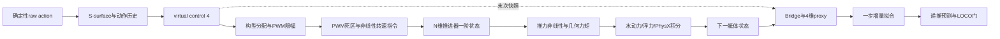

> **当前方向更新：** 固定pooled/分构型/运动学对照已完成，位姿单步有收益、动力学泛化和长递推仍失败；当前入口为[方向对照结果](phase8_3_direction_assay.md)。以下为前次调查记录。

> **最新修复进展：** 已完成一次稳定性约束修复对照，发散20/21→0/21，但预测精度仍不合格；参见[修复结果](phase8_3_repair_results.md)。以下保留前一阶段的事实与当时边界。

# Phase 8.3：控制链缺口、实际失败位置与下一步

更新：2026-09-12。本轮用户授权：先更新规划，补齐本地可确认的缺漏，查明失败位置与模型缺陷。本文是当前调查入口；此前批判报告和学长建议解析保留为推理背景。

## 1. 已查明什么

**至少对预先指定的 conditional 候选，失败发生在模型的递推预测阶段。** 拟合通过数值门，但21个源验证episode中20个触发 `rollout_diverged`，触发量都是预测角速度越过原协议的100 rad/s上限。不能把这个发现扩大为全部候选的共同根因，也不能说艇体在仿真中真的以该角速度运动。

同一构型的实际下一状态与预测相差很大。例如 `uuv4_angled / coupled-chirp` 第15次预测（零基transition index=14）：预测pitch角速度120.3038469 rad/s，数据中的实际下一pitch角速度0.3897925 rad/s。输入仍有界，yaw控制为0；此时诊断递推的 `actuator_memory_4` 与该行记录值一致。因此这个案例首先证明了**预测状态自身的误差扩散**，不是已经证明了proxy递推代码出错。

另外确认了两个episode边界缺口：`old_actions`跨reset保留；`_actions`在reset后还会被下一次 `_pre_physics_step` 复制到奖励动作历史。已用可选 `episode_local_v1` 模式修复，默认 `legacy` 保留用于历史对照。第二项在旧辨识配置中对应惩罚权重为0，不能拿它解释本次辨识失败。

**尚未查明的是各控制/表征缺口对模型失败的贡献大小。** 修复reset是否改善模型、最后子步标签遗漏造成多大影响、PCA2条件化是否不足，都还需要对照证据。

## 2. 本次回放的证据边界

- 固定case：heldout=base；conditional / so3_identity_v1 / prefix2 / ridge1e-8 / normalization=none / structured_pca2。
- candidate ID：`4c66d783f92795e479ccf427601e0fed61573d263cdedb294f42d13271d67d42`。
- 只打开7个源构型各2个fit、3个validation，共35个episode；没有读取base轨迹或任何test轨迹，没有跑候选网格或formal LOCO。
- 使用原生产 `_fit_model`、source PCA和 `rollout_episode_v21`；失败门限、SO(3)更新、memory递推均未修改。
- `design_rank=66/66`，effective rank=22.877651936451652，regularized condition=10511648.472376157；这四项与封存ledger逐项精确一致。旧ledger没有保留此失败模型的hash，因此不能声称与旧拟合模型字节完全相同。
- **1/5/20/60探针均从episode第0行开始，不是原协议的所有滑动窗口指标。** full=512探针对应原full-horizon失败门。1/5/20/60/512的数值门存活数分别为21/21、21/21、16/21、9/21、1/21；“存活”不表示预测准确。
- 下表只是失败时刻，不是性能排名；列内数字采用第几次预测，即1基。

| 源构型 | PRBS | multisine | chirp | 越界量 |
|---|---:|---:|---:|---|
| long_body | 273 | 493 | 289 | roll角速度 |
| heavy_moderate | 512步未触发门 | 428 | 368 | yaw角速度 |
| asymmetric | 171 | 191 | 117 | roll角速度 |
| uuv6 | 27 | 27 | 31 | roll角速度 |
| uuv6_angled | 28 | 28 | 28 | roll角速度 |
| uuv4 | 21 | 16 | 16 | pitch角速度 |
| uuv4_angled | 17 | 18 | 15 | pitch；PRBS同时roll越界 |

可复核证据：[完整本地诊断JSON](evidence/phase8_3/fixed-source-20260912.json)，原始运行文件 `tmp/phase8_3/fixed-source-20260912/report.json`。JSON包含35个读取绑定、每个探针的首次失败状态/增量/控制、模型与PCA hash，以及运行时代码hash。`runtime_head`所在工作区有未提交修改，代码hash才是新增诊断实现的绑定；运行后又补强了路径重定向/协议hash防护，未重拟合。原模型、指标与formal evaluator文件未改变。

## 3. 整条链路的缺口表

当前辨识链是：

| 边界 | 当前证据/缺口 | 本轮处理 | 剩余闭合条件 |
|---|---|---|---|
| 研究目标→输入语义 | 默认collector给定raw action；默认euler路径不等同于真正艇体状态反馈控制器 | 规划明确区分raw-input与pre-TAM接口；记录真实controller arguments | 8.3-03选择接口，不能把不同被辨识系统混为一谈 |
| 控制时钟→physics时钟 | 静态链路每个apply重算控制，cfg decimation=2；默认差分项使u1/u2可能不同 | 真实 `_pid_control` 方法本地测试；新增逐子步观察器 | 实际加载DirectRLEnv源码与trace验证调用顺序、dt/token；不直接改成每control step算一次 |
| episode reset→动作历史 | old_actions未清零；_actions会回流到奖励历史；actions_i当前未使用 | 新增episode_local_v1，清选定env的old_actions/actions_i/_actions；测试非法模式与隔离 | 实测cold/warm物理匹配；修复收益待测。legacy默认仍含历史缺口 |
| virtual4→PWM→实际wrench | 同维控制不保证跨构型同单位/同物理作用；分配后仍有clip、死区和非线性 | 记录raw/clipped PWM、转速指令、推进器状态、thruster-only与总施加力/矩 | 同轨迹重建每层残差；不要把TAM逆映射当作消除了几何 |
| actuator memory→可部署状态 | 四维virtual-control低通不是N维转子状态，也不天然具有Markov充分性 | 同时记录proxy所需历史与N维truth供oracle诊断；保留原proxy | 8.3-03比较可部署估计器；truth不能当部署传感器。估计器尚未实现 |
| 可选控制钩子→时间尺度 | D滤波/深度积分在physics调用内用control_dt；parametric gain时钟亦需审计；旧辨识默认未启用这些路径 | 登记为启用前必须验证的分支，不混入当前根因 | 独立时间尺度试验；没有证据时不得在新采集里默默打开 |
| physics→transition日志 | 旧Bridge保留末次控制；只要求token递增；terminal自动reset可造成末次telemetry失效 | 观察器把每次apply和after-physics、dones/reset事件分开；snapshot复制；限制条数 | 实测trace-on/off一致性；新版collector必须明确完整区间语义，旧schema不补写伪造u1 |
| 环境context→识别边界 | 当前默认无随机扰动/传感噪声；环境量的oracle与estimated层级不同 | 保留字段来源与证据等级；推进器wrench不是包含重力的净动力学输入 | 8.3-03/后续环境phase单独建立可观测/可估计合同 |
| 一步拟合→稳定递推 | ridge及rank/condition门只约束拟合数值，不给动力学稳定性保证 | 单case回放补齐首次失败信息；确认角速度递推越界 | 新pilot比较一步精度、多步误差增长、训练支持域和递推稳定性 |
| 构型descriptor→conditional模型 | 7个源构型上PCA2压缩、状态/输入与context交互；满秩不证明信息充分或泛化 | 保留conditional失败事实，不把PCA/几何直接定成根因 | 同数据比较无context、当前PCA、可解释物理特征与分构型基线；禁止test调参 |
| 候选失败→筛选/closeout | 原ledger总括错误丢失失败细节；NO_SELECTION本身是有效拒绝 | 新增独立诊断输出，不改旧ledger或门限；CFR-02完成 | 其他候选的失败机制仍未逐一定位，不扩大本次case结论 |
| 模型→MPC→执行→fallback | 旧MPC是8PWM接口；当前预测模型不能直接接入旧控制链 | Phase9入口继续阻塞，明确状态/input/dt一致及接管状态 | 有合格模型后才做匹配接口、并联仲裁、故障接管与闭环对照 |

## 4. 模型的缺陷应如何表述

1. **已证实的行为缺陷：** 此conditional候选源域递推就不稳定，不能讨论它的跨构型闭环泛化。uuv4系列更早越界是观察，不是“推进器少导致失败”的因果结论。
2. **已确认的训练目标限制：** [model_v21.py](../koopman/model_v21.py)用一步增量ridge回归；rank/condition门不检查闭环或多步稳定性。使用预测状态重新生成特征时，误差会改变后续回归输入。训练目标与实际使用方式的差距应作为新pilot的重点。
3. **合理但待验证的结构缺陷：** 末次子步输入不能完整描述区间、proxy遗漏执行器状态、PCA2条件化表达不足、激励/状态覆盖不足。这些可能共同影响结果，不能通过修一个reset就宣称全部解决。
4. **不能从现有结果推出：** 所有Koopman方法无效；线性控制应自动晋级；扩大字典或重采96段就会成功；门限从100放宽后就算修复。pooled identity与simple-linear等价是模型定义，不能解释成训练自动“退化”。

## 5. 下一步的顺序与停止条件

**当前优先级是把可验证的控制合同闭合，然后再谈模型升级。**

1. 本地调查已产出诊断、可选reset修复、逐子步记录器和单case运行入口。先完成 [trace运行准备](phase8_3_trace_runbook.md) 的源码打包/加载绑定检查；当前没有不可变clean bundle，也没有Isaac运行证据，所以08.3-01整体仍为部分完成。
2. 8.3-02先做base的32+32步trace-on/off。通过后才按预先限定的base/uuv6/uuv4、两seed、四激励、cold/warm矩阵取证。任何意外reset、丢子步、非有限量或日志改变轨迹，都停止并保留失败。现有2368区间预算不自动增加reset修复A/B的额外矩阵。
3. 8.3-03用同一批轨迹分开问：输入时间语义是否改善；部署可获得的memory是否改善；构型条件是否改善。先列出训练/验证切分和比较项，再计算结果，控制“看结果后改假设”。32步不足以证明60/512步能力。
4. 决策可以是direct pre-TAM、保留inner controller并明确其内部状态/参考输入，或使用substep-aware表示；第三项是时间表示，能与前两项组合。没有一种因本轮诊断被自动选中。
5. 只有上述证据支持继续，8.4才实施一种合同并做fresh pilot。若分构型线性模型就能回答更窄的问题，可建议修改研究目标；若都无改进，NO_GO/INCONCLUSIVE应停止默认预算。Phase9需要另一个合格model/control handoff。

这些步骤避免把“工程缺口已修”误写成“科学假设已证实”。Phase8.2仍是 `VERIFIED + NO_SELECTION + model_handoff=false`。
